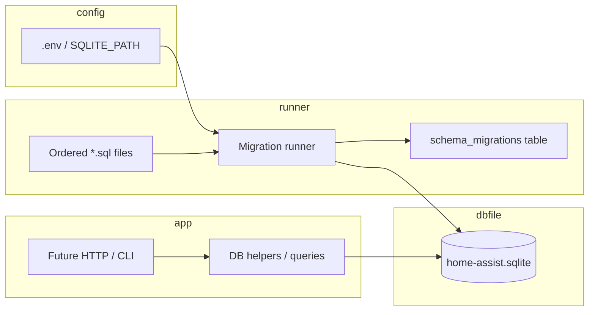

# Phase 1: Data model & SQLite - Research

**Researched:** 2026-04-15  
**Domain:** SQLite persistence with `bun:sqlite`, versioned SQL migrations, integration testing  
**Confidence:** HIGH

<user_constraints>
## User Constraints (from CONTEXT.md)

### Locked Decisions

Content from `.planning/phases/01-data-model-sqlite/01-CONTEXT.md` — **## Implementation Decisions**

#### 1. User identity in the DB (HOME-02)

- **D-01:** `users` table with `id INTEGER PRIMARY KEY AUTOINCREMENT` as the stable identifier for membership and future “alert recipient” references.
- **D-02:** Add optional `display_name TEXT` (nullable) for developer/debug labeling only—**no passwords, OAuth, or sessions** in Phase 1 (aligns with PROJECT.md “minimal auth / dev tokens later”).
- **D-03:** Do **not** require UUIDs in v1; integer primary keys are preferred for simplicity. Optional migration to UUIDs can align with **POSTGRES-01** later if needed.

#### 2. Home and membership shape (HOME-01, HOME-02)

- **D-04:** `homes` table: at minimum `id`, `name` (non-empty string), and `created_at` (ISO-friendly stored type).
- **D-05:** Membership as a **many-to-many** junction table (e.g. `home_members` or `home_users`): `home_id`, `user_id`, **`UNIQUE(home_id, user_id)`**, and `created_at`.
- **D-06:** **No roles or permissions** in Phase 1 unless a later phase requires them—membership is binary (user belongs to home or not).

#### 3. Schema evolution (migrations vs bootstrap)

- **D-07:** Use **versioned SQL migration files** (numeric prefix, e.g. `001_initial.sql`, `002_...sql`) applied by a **small runner** in TypeScript using `bun:sqlite`, so the learning path is explicit and diffable (matches PROJECT.md “readable code paths”).
- **D-08:** Avoid a single opaque “magic” bootstrap with no history; new schema changes add a new migration file.

#### 4. Database file location and configuration

- **D-09:** Default SQLite file path: **`data/home-assist.sqlite`** (relative to project root). Ensure **`data/` is gitignored** so local DB files are not committed.
- **D-10:** Support an **environment override** (e.g. `SQLITE_PATH` or `DATABASE_URL` pointing at a file path) so paths stay flexible on different machines; Bun loads `.env` automatically per project conventions.

#### 5. Proof for success criteria (script vs test)

- **D-11:** At least one **`bun test`** integration test that: (1) applies migrations, (2) creates a home, (3) creates a user, (4) attaches membership, (5) reopens the DB (or new connection) and verifies rows persist—covers roadmap “short script or API test” and **data survives process restart**.
- **D-12:** Optional: a small **`bun run`** script for manual exploration (not required for phase success if the test is present).

### Claude's Discretion

- Exact migration directory name (`db/migrations/` vs `migrations/`), table naming (`home_members` vs `memberships`), and whether to enable SQLite **WAL** pragma for dev convenience.
- Exact TypeScript API surface for “create home + attach user” (thin `lib/db.ts` vs inline in test) as long as behavior matches decisions above.

### Deferred Ideas (OUT OF SCOPE)

From **## Deferred Ideas** in CONTEXT:

- **Real central node / Buildroot / RPi images** — Out of scope; simulated node in Phase 3.
- **HomeKit, iOS/Android, native clients** — Out of scope for v1; web only in Phase 4.
- **Webhook orchestrator HTTP API, fan-out, subscribers** — Phases 2–4; not Phase 1.
- **Real auth (OAuth, sessions)** — AUTH-01 / v2; Phase 1 uses in-DB user rows only.
</user_constraints>

<phase_requirements>
## Phase Requirements

| ID | Description | Research Support |
|----|-------------|-------------------|
| HOME-01 | Developer can create a home (logical “site”) with a stable identifier. | `homes` table + `INTEGER PRIMARY KEY`; migrations establish schema; `lastInsertRowid` from inserts [CITED: Bun SQLite docs]. |
| HOME-02 | Developer can associate users with a home (minimal membership model). | `users` + junction `home_members` with `UNIQUE(home_id, user_id)` and FKs; binary membership per D-06. |
</phase_requirements>

## Summary

Phase 1 adds a **file-backed SQLite** data layer using Bun’s built-in **`bun:sqlite`** driver (synchronous API, `Database` + prepared statements, transactions). Schema changes ship as **ordered `.sql` files** applied once and recorded in a **`schema_migrations`** (or equivalent) table so the runner is idempotent and auditable. Each connection should run **`PRAGMA foreign_keys = ON`** because SQLite defaults foreign key enforcement to off unless the application enables it [CITED: sqlite.org pragma docs].

**Primary recommendation:** Implement a thin `migrate(path)` that opens the DB, enables foreign keys, reads migration files in lexical order, skips already-applied versions, wraps each migration in **`db.transaction()`** for atomicity, then exposes small helpers or raw SQL for “create home / user / membership.” Prove persistence with a **`bun test`** integration test that uses a **temporary file path** (not `:memory:`), closes the `Database`, reopens a new `Database` on the same path, and asserts rows exist.

## Architectural Responsibility Map

| Capability | Primary Tier | Secondary Tier | Rationale |
|------------|--------------|----------------|-----------|
| SQLite file + schema | API / Backend (library module) | — | Persistence and migrations live in TS modules invoked by future HTTP layer; no browser tier. |
| Migration runner | API / Backend | — | Runs at process startup or test setup; same code for app and tests. |
| Env-based DB path | Configuration | API / Backend | `SQLITE_PATH` / `DATABASE_URL` resolved once when opening `Database`. |
| Integration test (restart persistence) | Test harness | Database / Storage | Validates file durability via close + reopen. |

## Project Constraints (from `.cursor/rules/`)

- **Bun-first:** Use Bun for runtime, `bun run`, `bun test`; stack doc emphasizes **Bun’s SQLite module** for lab storage (see embedded stack in `gsd-project.md`).
- **Learning clarity:** Prefer explicit, readable code paths over opaque magic—aligns with versioned SQL + small runner in CONTEXT.
- **GSD workflow:** Planning/execution should go through GSD commands when changing the repo; this research artifact is produced for `/gsd-plan-phase`.

## Standard Stack

### Core

| Library | Version | Purpose | Why Standard |
|---------|---------|---------|--------------|
| `bun:sqlite` | Bundled with Bun (see below) | `Database`, statements, transactions, `db.run()` | Native Bun driver; no extra dependency; API inspired by better-sqlite3 [CITED: https://bun.sh/docs/api/sqlite] |
| Bun runtime | 1.3.8 (workspace) | Execute TS, tests, scripts | Project lock/stack [VERIFIED: `bun --version` in dev environment] |

### Supporting

| Library | Version | Purpose | When to Use |
|---------|---------|-------------|-------------|
| `bun:test` | Bundled | Assertions, `test()` / `describe()` | All automated verification for this phase |
| — | — | No ORM | Per CONTEXT; raw SQL + small runner |

### Alternatives Considered

| Instead of | Could Use | Tradeoff |
|------------|-----------|----------|
| File SQLite | `:memory:` only | Cannot prove “survives process restart” (D-11); use file path in integration test |
| `bun:sqlite` | `better-sqlite3` via npm | Extra dependency; CONTEXT locks Bun module |
| UUID PKs | Integer PKs | Deferred per D-03; integers simpler for v1 |

**Installation:**

```bash
# No extra npm packages required for SQLite — use built-in bun:sqlite
bun install   # keeps @types/bun / typescript peer deps only
```

**Version verification:** `bun:sqlite` is not an npm package; it ships with Bun. Confirmed Bun **1.3.8** in this environment [VERIFIED: local CLI]. For API details, use [Bun SQLite documentation](https://bun.sh/docs/api/sqlite).

## Architecture Patterns

### System Architecture Diagram



### Recommended Project Structure

```
src/
├── db/
│   ├── database.ts      # open DB, pragmas, path resolution
│   ├── migrate.ts       # apply pending migrations, record versions
│   └── migrations/
│       ├── 001_initial.sql
│       └── ...
└── ...
# or: db/migrations/ at repo root — Claude's discretion
```

### Pattern 1: Enable foreign keys on every connection

**What:** Run `PRAGMA foreign_keys = ON` immediately after opening the database (and in tests).  
**When to use:** Always for this project so `REFERENCES` constraints are enforced. SQLite’s default FK enforcement is **OFF** unless the connection opts in [CITED: https://www.sqlite.org/pragma.html#pragma_foreign_keys].

**Example:**

```typescript
// Source: https://www.sqlite.org/pragma.html#pragma_foreign_keys (pragma behavior);
//         https://bun.sh/docs/api/sqlite (Database#run)
import { Database } from "bun:sqlite";

const db = new Database("data/home-assist.sqlite", { create: true });
db.run("PRAGMA foreign_keys = ON;");
```

### Pattern 2: Migration runner with `schema_migrations`

**What:**  
1. Ensure a migrations table exists (often in `001` or bootstrap step).  
2. List migration files (e.g. `001_*.sql`, `002_*.sql`), sort lexicographically.  
3. For each filename not in `schema_migrations`, run its SQL inside **`db.transaction(() => { ... })`**, then insert the version key.  
**When to use:** All schema changes (D-07, D-08).

`db.transaction()` wraps a function, issues `BEGIN`/`COMMIT`, and **rolls back on throw** [CITED: https://bun.sh/docs/api/sqlite#transactions].

**Example shape:**

```typescript
// Source: https://bun.sh/docs/api/sqlite#transactions
import { Database } from "bun:sqlite";

function applyMigration(db: Database, sql: string, version: string) {
  const run = db.transaction(() => {
    db.run(sql); // multi-statement SQL supported in one run [CITED: bun sqlite intro]
    db.run(
      "INSERT INTO schema_migrations (version) VALUES ($version)",
      { $version: version },
    );
  });
  run();
}
```

**Table naming:** `schema_migrations` with a single `version` column (e.g. `TEXT PRIMARY KEY`) is a common convention [ASSUMED: ecosystem pattern; confirm column types in implementation].

### Pattern 3: Optional WAL for development

**What:** `db.run("PRAGMA journal_mode = WAL;");` after opening the file DB. Improves typical read/write patterns; creates `-wal`/`-shm` sidecars (macOS behavior documented in Bun docs) [CITED: https://bun.sh/docs/api/sqlite#wal-mode].  
**When to use:** Claude’s discretion; not required for Phase 1 correctness.

### Anti-Patterns to Avoid

- **Relying on default foreign keys:** Without `PRAGMA foreign_keys=ON`, invalid `home_id`/`user_id` may insert silently [CITED: sqlite.org pragma docs].
- **Using `:memory:` for the restart test:** Does not demonstrate durability across connections the way a file does (D-11).
- **Opaque single bootstrap:** Violates D-08; keep one migration file per change.

## Don't Hand-Roll

| Problem | Don't Build | Use Instead | Why |
|---------|-------------|-------------|-----|
| SQLite driver | Wrapper around Node `sqlite3` | `bun:sqlite` `Database` | Locked stack; native performance and sync API [CITED: Bun docs] |
| Ad-hoc schema drift | Editing DB by hand only | Versioned SQL + migration table | Auditable history (D-07, D-08) |
| Complex migration framework | Full ORM | Small runner + SQL files | CONTEXT defers ORM; keeps learning path explicit |

**Key insight:** The “hard part” is **ordering, idempotency, and FK semantics**—a 30–50 line runner plus SQL files beats adopting an ORM this early.

## Common Pitfalls

### Pitfall 1: Foreign keys appear ignored

**What goes wrong:** Inserts succeed with invalid `home_id` / `user_id`.  
**Why it happens:** FK enforcement is off by default per connection [CITED: sqlite.org `foreign_keys` pragma].  
**How to avoid:** `PRAGMA foreign_keys = ON` on open; define `FOREIGN KEY (...) REFERENCES ...` in `CREATE TABLE`.  
**Warning signs:** Tests pass without FK clauses but production data is corrupt.

### Pitfall 2: Migration partially applied

**What goes wrong:** Crash mid-file leaves mixed schema.  
**Why it happens:** Non-transactional DDL execution.  
**How to avoid:** Wrap each migration’s application + version insert in `db.transaction()` [CITED: Bun transactions].  
**Warning signs:** `schema_migrations` missing a version but tables half-created.

### Pitfall 3: WAL sidecars on macOS

**What goes wrong:** Extra `-wal`/`-shm` files beside `data/home-assist.sqlite`; confusion in git or backups.  
**Why it happens:** Documented macOS + WAL behavior in Bun [CITED: Bun WAL section].  
**How to avoid:** Keep `data/` gitignored (already in `.gitignore` [VERIFIED: repo `.gitignore`]); optionally checkpoint/close per Bun WAL cleanup example if you need a single file artifact.

### Pitfall 4: Strict vs non-strict parameter binding

**What goes wrong:** Typos in named parameters silently bind `NULL`.  
**Why it happens:** Default `strict: false` on `Database` [CITED: Bun SQLite strict mode].  
**How to avoid:** Use consistent `$param` names; consider `strict: true` for new code if team prefers fail-fast.

## Code Examples

### Open DB and run DDL (metadata)

```typescript
// Source: https://bun.sh/docs/api/sqlite (Database constructor, .run)
import { Database } from "bun:sqlite";

const db = new Database("data/home-assist.sqlite", { create: true });
db.run("PRAGMA foreign_keys = ON;");
const result = db.run(
  "CREATE TABLE IF NOT EXISTS homes (id INTEGER PRIMARY KEY AUTOINCREMENT, name TEXT NOT NULL, created_at TEXT NOT NULL);",
);
// result.lastInsertRowid / result.changes — see Bun docs
```

### Suggested DDL aligned with CONTEXT (illustrative)

```sql
-- Source: CONTEXT D-01–D-06; SQLite FK docs https://www.sqlite.org/foreignkeys.html
CREATE TABLE users (
  id INTEGER PRIMARY KEY AUTOINCREMENT,
  display_name TEXT,
  created_at TEXT NOT NULL DEFAULT (datetime('now'))
);

CREATE TABLE homes (
  id INTEGER PRIMARY KEY AUTOINCREMENT,
  name TEXT NOT NULL CHECK (length(trim(name)) > 0),
  created_at TEXT NOT NULL DEFAULT (datetime('now'))
);

CREATE TABLE home_members (
  home_id INTEGER NOT NULL REFERENCES homes (id) ON DELETE CASCADE,
  user_id INTEGER NOT NULL REFERENCES users (id) ON DELETE CASCADE,
  created_at TEXT NOT NULL DEFAULT (datetime('now')),
  UNIQUE (home_id, user_id)
);
```

`ON DELETE CASCADE` is optional [ASSUMED]; planner may choose `RESTRICT` for stricter lab behavior—either way, FK enforcement requires pragma ON.

### Integration test: persistence across “restart”

```typescript
// Source: https://bun.sh/docs/api/sqlite; project CONTEXT D-11
import { test, expect } from "bun:test";
import { Database } from "bun:sqlite";
import { join } from "node:path";
import { mkdtempSync } from "node:fs";
import { tmpdir } from "node:os";

test("home and membership survive db reopen", () => {
  const dir = mkdtempSync(join(tmpdir(), "home-assist-"));
  const path = join(dir, "test.sqlite");

  {
    const db = new Database(path, { create: true });
    db.run("PRAGMA foreign_keys = ON;");
    // run migrations, insert home + user + home_members
    db.close();
  }

  const db2 = new Database(path, { readonly: false });
  db2.run("PRAGMA foreign_keys = ON;");
  const row = db2.query("SELECT COUNT(*) as c FROM home_members").get() as { c: number };
  expect(row.c).toBe(1);
  db2.close();
});
```

## State of the Art

| Old Approach | Current Approach | When Changed | Impact |
|----------------|------------------|--------------|--------|
| Separate Node `sqlite3` package | `bun:sqlite` built-in | Bun 1.x | Fewer deps; sync API |
| UUID-first keys for small apps | Integer PK, UUID later if needed | CONTEXT D-03 | Simpler joins in v1 |

**Deprecated/outdated:**

- Depending on SQLite FK default without pragma: still unsafe; always set explicitly [CITED: sqlite.org].

## Assumptions Log

| # | Claim | Section | Risk if Wrong |
|---|-------|---------|----------------|
| A1 | `schema_migrations` uses a simple `version` text key and optional `applied_at` | Migration runner | Low; table shape is internal |
| A2 | `ON DELETE CASCADE` on junction is acceptable | Code Examples | Easy to change to `RESTRICT` in SQL |
| A3 | `datetime('now')` and `TEXT` timestamps are “ISO-friendly” enough for D-04 | Table design | Switch to `INTEGER` unix ms later if needed |

## Open Questions

1. **Exact env var name (`SQLITE_PATH` vs `DATABASE_URL`)**  
   - What we know: CONTEXT allows either pattern (D-10).  
   - What’s unclear: Single canonical name for docs and tests.  
   - Recommendation: Pick one in PLAN.md; support both if trivial.

2. **Whether to enable WAL in v1**  
   - What we know: Bun documents WAL and macOS sidecar behavior.  
   - What’s unclear: Team preference for extra files vs throughput.  
   - Recommendation: Claude’s discretion; default OFF until concurrency needs appear.

## Environment Availability

| Dependency | Required By | Available | Version | Fallback |
|------------|-------------|-----------|---------|----------|
| Bun | `bun:sqlite`, `bun test` | ✓ | 1.3.8 [VERIFIED: this machine] | Install Bun from bun.sh |
| SQLite (system / bundled) | `bun:sqlite` | ✓ | Via Bun | — |
| PostgreSQL | Phase 1 | — | — | Out of scope (POSTGRES-01 later) |

**Missing dependencies with no fallback:** None for Phase 1.

**Missing dependencies with fallback:** None identified.

## Validation Architecture

> `workflow.nyquist_validation` is **true** in `.planning/config.json` — this section is required.

### Test Framework

| Property | Value |
|----------|-------|
| Framework | `bun:test` (built-in) [CITED: `.planning/codebase/TESTING.md`] |
| Config file | none — see Wave 0 in TESTING.md |
| Quick run command | `bun test` |
| Full suite command | `bun test` (same; single suite expected for small repo) |

### Phase Requirements → Test Map

| Req ID | Behavior | Test Type | Automated Command | File Exists? |
|--------|----------|-----------|-------------------|--------------|
| HOME-01 | Create home, stable `id` | Integration | `bun test path/to/db.test.ts` | ❌ Wave 0 |
| HOME-02 | Attach user to home via junction | Integration | same | ❌ Wave 0 |
| D-11 | Data survives close/reopen | Integration | same | ❌ Wave 0 |

### Sampling Rate

- **Per task commit:** `bun test` (or `bun test <changed-file>.test.ts` when applicable)
- **Per wave merge:** `bun test`
- **Phase gate:** Full `bun test` green before `/gsd-verify-work`

### Wave 0 Gaps

- [ ] `src/db/**/*.test.ts` or co-located `migrate.test.ts` — covers HOME-01, HOME-02, D-11
- [ ] Ensure test uses **temp file** path, not `:memory:`, for restart assertion
- [ ] Optional: `package.json` `"scripts": { "test": "bun test" }` for discoverability [ASSUMED: nice-to-have]

*(No gaps once the integration test file exists and passes.)*

## Security Domain

Phase 1 is **local SQLite** with **no auth**, **no network** in scope. Apply ASVS-style thinking lightly:

### Applicable ASVS Categories

| ASVS Category | Applies | Standard Control |
|---------------|---------|------------------|
| V2 Authentication | no | N/A — D-02 excludes real auth |
| V3 Session Management | no | — |
| V4 Access Control | partial | Single-user lab; no multi-tenant enforcement yet |
| V5 Input Validation | yes | `CHECK` / app validation for non-empty `name`; reject null home/user IDs in API later |
| V6 Cryptography | no | No secrets in DB in Phase 1 |

### Known Threat Patterns for this stack

| Pattern | STRIDE | Standard Mitigation |
|---------|--------|----------------------|
| SQL injection in ad-hoc queries | Tampering | Parameterized statements (`db.query` + bound params) [CITED: Bun docs] |
| Invalid FK relationships | Tampering | `PRAGMA foreign_keys=ON` + FK clauses |
| Accidental commit of local DB | Information disclosure | `data/` gitignored [VERIFIED] |

## Sources

### Primary (HIGH confidence)

- [Bun SQLite API](https://bun.sh/docs/api/sqlite) — `Database`, `run`, `query`, `prepare`, `transaction`, WAL, multi-statement `run`
- [SQLite PRAGMA foreign_keys](https://www.sqlite.org/pragma.html#pragma_foreign_keys) — default OFF; application must enable
- Repo `.gitignore` — `data/` ignored [VERIFIED]

### Secondary (MEDIUM confidence)

- `.planning/codebase/TESTING.md`, `STACK.md`, `CONVENTIONS.md` — project conventions

### Tertiary (LOW confidence)

- Common `schema_migrations` single-column pattern — ecosystem norm; confirm in implementation [ASSUMED]

## Metadata

**Confidence breakdown:**

- Standard stack: **HIGH** — Bun docs + local version check  
- Architecture: **HIGH** — aligns with CONTEXT + Bun transaction API  
- Pitfalls: **HIGH** — FK pragma is well-documented  

**Research date:** 2026-04-15  
**Valid until:** ~2026-05-15 (re-check if Bun SQLite API or SQLite defaults change)

## RESEARCH COMPLETE
