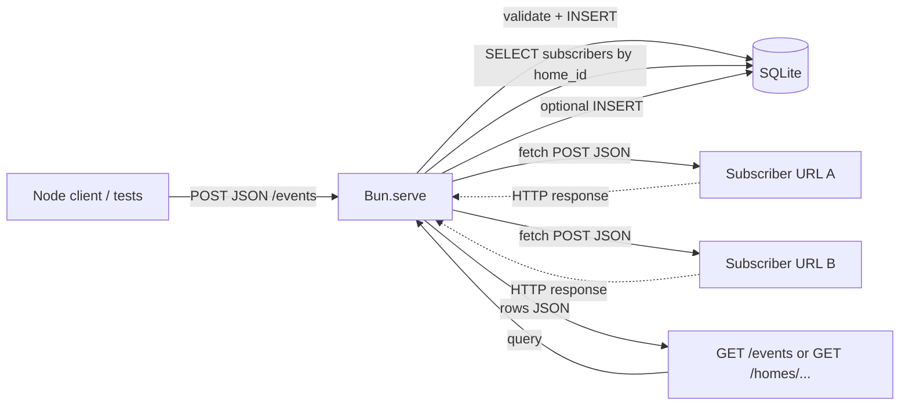

# Phase 2: Webhook orchestrator - Research

**Researched:** 2026-04-15  
**Domain:** Bun HTTP (`Bun.serve`), `bun:sqlite` persistence, webhook fan-out (`fetch`)  
**Confidence:** HIGH (Bun APIs verified via Context7 + official docs); MEDIUM (exact HTTP surface left to planner)

<user_constraints>
## User Constraints

No `02-*-CONTEXT.md` exists for this phase. **Inherited upstream contracts** from Phase 1 (`01-CONTEXT.md`) apply to SQLite location, migrations, and **`homes.id`** as the foreign-key target for `home_id` on new tables.

### Locked decisions (inherited — treat as binding)

- **Homes:** `homes` has stable integer `id` (`INTEGER PRIMARY KEY AUTOINCREMENT`). [Phase 1 D-04]
- **Migrations:** Versioned SQL files (e.g. `00x_*.sql`) applied by a small TypeScript runner using `bun:sqlite`—extend with new files for `events` / `subscribers` / optional `event_deliveries`. [Phase 1 D-07, D-08]
- **DB file:** Default `data/home-assist.sqlite` with env override (e.g. `SQLITE_PATH` / file path). [Phase 1 D-09, D-10]
- **Proof style:** At least one `bun test` that exercises persistence; Phase 2 should add tests for HTTP + fan-out. [Phase 1 D-11]

### Claude's Discretion

_Not present in Phase 1 CONTEXT as a labeled section; Phase 1 noted discretion for migration directory name, table naming, WAL—Phase 2 may align with whatever Phase 1 implemented._

### Deferred Ideas (OUT OF SCOPE)

- Real central node / Buildroot / RPi images; HomeKit / native clients; **real OAuth/sessions** (AUTH-01). [Phase 1 deferred + `REQUIREMENTS.md` v2]
</user_constraints>

<phase_requirements>
## Phase Requirements

| ID | Description | Research Support |
|----|-------------|------------------|
| HOOK-01 | HTTP API accepts POSTed events (home id, event type, optional JSON body) | `Bun.serve` `routes` with `POST` + `await req.json()`; validate `home_id` exists (`homes`) before insert [CITED: server.mdx pattern] |
| HOOK-02 | Persisted events stored and queryable | New `events` table + migration; `GET` list (and/or `GET` by id) using `bun:sqlite` queries [CITED: https://bun.sh/docs/api/sqlite] |
| HOOK-03 | Subscribers register a target (HTTP callback URL or in-process list) per home | `subscribers` (or `home_subscribers`) table with `home_id` FK; `POST`/`PUT` handlers to upsert; callback URL as `TEXT NOT NULL` for v1 |
| HOOK-04 | On each new event, forward to all subscribers for that home | After insert, load subscribers for `home_id`, **`fetch(callbackUrl, { method, headers, body })`** in parallel; **`Promise.allSettled`** so one failure does not block others [CITED: https://github.com/oven-sh/bun/blob/main/docs/guides/http/fetch.mdx] |
</phase_requirements>

## Summary

Phase 2 adds a **single Bun process** that exposes an HTTP API for **ingesting node events**, **persisting** them in SQLite beside Phase 1’s `homes` / `users` / membership tables, **registering per-home subscriber callbacks**, and **fanning out** each new event to every subscriber for that home using **`fetch()`**. The stack stays aligned with `PROJECT.md`: no separate Node server, no Express/Vite—use **`Bun.serve()`** with the Web **`Request` / `Response`** API, **`req.json()`** for JSON bodies, and **`bun:sqlite`** for storage with **versioned SQL migrations** continued from Phase 1. [CITED: https://github.com/oven-sh/bun/blob/main/docs/runtime/http/server.mdx] [CITED: https://bun.sh/docs/api/sqlite]

**Primary recommendation:** Implement routes with `Bun.serve({ port, routes: { ... }, fetch })`, insert events and subscribers through prepared statements and **foreign keys to `homes(id)`**, run fan-out **after** the event row is committed (same transaction or subsequent step—planner’s choice), record delivery attempts in an **optional** `event_deliveries` (or similar) table so HOOK-04 is observable even when callbacks fail, and prove behavior with **`bun:test`** hitting a server on a **random/ephemeral port**.

## Architectural Responsibility Map

| Capability | Primary Tier | Secondary Tier | Rationale |
|------------|--------------|----------------|-----------|
| HTTP ingest (POST events) | API / Backend | — | `Bun.serve` handlers validate input and call persistence |
| Event listing (GET) | API / Backend | — | Read path from SQLite (filter by `home_id`, order, limit) |
| Subscriber CRUD | API / Backend | — | Persisted rows scoped by `home_id` |
| Fan-out webhooks | API / Backend | External HTTP | Orchestrator calls subscriber URLs via `fetch`; no browser |
| SQLite schema & migrations | Database / Storage | API | Migrations own DDL; handlers own transactions |
| Idempotency / dedupe | API / Backend | Database | If implemented, enforced in DB + request contract |

## Project Constraints (from `.cursor/rules/` and planning docs)

- **Stack:** Bun (not Node for app scripts), TypeScript, SQLite via **`bun:sqlite`** for the lab; prefer **`Bun.serve()`** over Express/Vite when adding HTTP. [`.cursor/rules/gsd-project.md` / `PROJECT.md`]
- **Scope:** One readable Bun service over microservices. [`PROJECT.md`]
- **Conventions:** Strict TS, `verbatimModuleSyntax`, kebab-case filenames for non-React modules, catch errors at HTTP handlers, return `Response` with proper status codes. [`.planning/codebase/CONVENTIONS.md`]
- **Env:** Bun loads `.env` automatically—use `process.env` / `Bun.env` for `PORT` and DB path; do not add `dotenv`. [CITED: https://bun.sh/docs/runtime/environment-variables]

## Standard Stack

### Core

| Library / module | Version | Purpose | Why Standard |
|------------------|---------|---------|----------------|
| **Bun** (runtime) | CLI **1.3.8** on dev machine [VERIFIED: `bun --version`]; npm `bun` meta **1.3.12** [VERIFIED: npm registry] | HTTP server, `fetch`, tests | Project mandate; single toolchain |
| **`bun:sqlite`** | Built-in | SQLite access, migrations runner | Fast, synchronous API; matches Phase 1 plan [CITED: https://bun.sh/docs/api/sqlite] |
| **`bun:test`** | Built-in | Unit / integration tests | Project `TESTING.md`; Jest-like `expect` [CITED: Bun test docs via Context7 `/oven-sh/bun`] |

### Supporting

| Item | Purpose | When to Use |
|------|---------|-------------|
| Optional **`event_deliveries`** table | Audit trail: `event_id`, `subscriber_id`, `status`, `http_status`, `error_text`, `created_at` | Satisfy “recorded deliveries” in roadmap success criteria when callbacks are flaky |

### Alternatives Considered

| Instead of | Could Use | Tradeoff |
|------------|-----------|----------|
| `Bun.serve` `routes` | Manual `fetch(req)` router only | `routes` gives method-specific handlers and cleaner paths (requires Bun **≥ 1.2.3** for `routes`) [CITED: server.mdx] |
| SQLite FK enforcement | App-only checks | FKs + `PRAGMA foreign_keys=ON` catch bad `home_id` early [CITED: SQLite foreign key docs — https://www.sqlite.org/foreignkeys.html] |

**Installation:** No new npm packages required for HTTP/SQLite/tests beyond existing `@types/bun` / TypeScript peer deps.

**Version verification:**

```bash
npm view bun version          # 1.3.12 [VERIFIED: npm registry]
bun --version                 # e.g. 1.3.8 [VERIFIED: local CLI]
```

## Architecture Patterns

### System Architecture Diagram



### Recommended project structure

```
src/                    # optional; may stay flatter in v1
├── server.ts           # Bun.serve setup, route wiring
├── routes/
│   ├── events.ts       # POST + GET handlers
│   └── subscribers.ts  # register / list
├── db/
│   ├── client.ts       # open DB, PRAGMAs, shared Database
│   └── migrations/     # 003_events.sql, 004_subscribers.sql ...
└── webhooks/
    └── fan-out.ts      # load subscribers, fetch, record results
```

(Exact layout is planner discretion; match `CONVENTIONS.md` kebab-case.)

### Pattern 1: HTTP routes with JSON body

**What:** Use `Bun.serve` `routes` with `POST: async (req) => { const body = await req.json(); ... }`.  
**When:** Ingest and subscriber registration endpoints.  
**Example:**

```typescript
// Source: https://github.com/oven-sh/bun/blob/main/docs/runtime/http/server.mdx
Bun.serve({
  port: Number(process.env.PORT ?? 3000),
  routes: {
    "/api/posts": {
      POST: async (req) => {
        const body = await req.json();
        return Response.json({ created: true, ...body });
      },
    },
  },
  fetch(req) {
    return new Response("Not Found", { status: 404 });
  },
});
```

`PORT` default is **illustrative**—pick one env name and document it (`PORT` is conventional). [ASSUMED: not a Bun built-in]

### Pattern 2: Fan-out with `fetch`

**What:** POST the serialized event payload to each subscriber URL with `Content-Type: application/json`.  
**When:** After the event is persisted (HOOK-04).  
**Example:**

```typescript
// Source: https://github.com/oven-sh/bun/blob/main/docs/guides/http/fetch.mdx
const response = await fetch(subscriberUrl, {
  method: "POST",
  body: JSON.stringify(payload),
  headers: { "Content-Type": "application/json" },
});
```

Use **`Promise.allSettled`** so partial failures are visible and can be logged per subscriber.

### Pattern 3: SQLite writes and reads

**What:** `Database` from `bun:sqlite`, `db.run` / `db.query` with named parameters, transactions for multi-step writes.  
**Example (abbreviated):**

```typescript
// Source: Context7 /oven-sh/bun (llms.txt) + https://bun.sh/docs/api/sqlite
import { Database } from "bun:sqlite";

const db = new Database("app.sqlite", { create: true });
db.run("PRAGMA foreign_keys = ON;");
const insert = db.query(
  "INSERT INTO events (home_id, event_type, body) VALUES ($homeId, $type, $body) RETURNING id",
);
const row = insert.get({
  $homeId: homeId,
  $type: eventType,
  $body: JSON.stringify(body),
}) as { id: number };
```

### Anti-Patterns to Avoid

- **Floating promises in route handlers:** `async` handlers should `await` fan-out or attach `.catch`—prefer `try/catch` + `allSettled`. [`.planning/codebase/CONVENTIONS.md`]
- **Trusting `home_id` without FK or check:** Inserting events for nonexistent homes violates traceability—verify against `homes` or rely on FK + proper `PRAGMA foreign_keys=ON`. [CITED: https://www.sqlite.org/foreignkeys.html]
- **Blocking the HTTP response on slow subscribers:** For a lab, returning **201** after persist **before** awaiting all webhooks is acceptable if documented; alternatively await `allSettled` with short timeouts—planner should pick one behavior and test it.

## Don't Hand-Roll

| Problem | Don't Build | Use Instead | Why |
|---------|-------------|-------------|-----|
| HTTP server | Express / Fastify in v1 | `Bun.serve` | Project convention; fewer deps [`.planning/codebase/STACK.md`] |
| JSON HTTP client for fan-out | Raw `node:http` | `fetch` | Native, documented, testable with mocks [CITED: fetch guide] |
| SQLite driver | `better-sqlite3` / `sql.js` for app code | `bun:sqlite` | Mandated stack; high performance [CITED: sqlite docs] |

**Key insight:** The complexity is in **correct ordering** (persist → fan-out), **failure capture**, and **tests**—not in protocol encoding.

## Common Pitfalls

### Pitfall 1: SQLite foreign keys off by default

**What goes wrong:** Rows insert with invalid `home_id` if FK enforcement is not enabled.  
**Why it happens:** SQLite requires `PRAGMA foreign_keys = ON` per connection. [CITED: https://www.sqlite.org/foreignkeys.html]  
**How to avoid:** Run `PRAGMA foreign_keys = ON` when opening the DB in the app and in tests.  
**Warning signs:** Tests pass without real `homes` rows; invalid IDs silently insert.

### Pitfall 2: `req.json()` throws on bad JSON

**What goes wrong:** Unhandled rejection / 500 on malformed body.  
**Why it happens:** `await req.json()` throws if body is not JSON.  
**How to avoid:** `try/catch` in handler; return **400** with a small error body for the lab.

### Pitfall 3: Fan-out failures hide HOOK-04 success

**What goes wrong:** Subscriber down → no proof of “attempted” delivery.  
**Why it happens:** Success criteria ask for delivery **attempts** or **recorded** deliveries.  
**How to avoid:** Insert into **`event_deliveries`** (or log table) per (event, subscriber) with status **attempted/failed/succeeded** and optional HTTP status code.

### Pitfall 4: Port collisions in tests

**What goes wrong:** Hard-coded port fails in parallel CI or when dev server runs.  
**Why it happens:** Fixed `3000` conflicts.  
**How to avoid:** **`port: 0`** (if supported) or ephemeral port pattern, or env `PORT` only in tests—verify with Bun version. [ASSUMED: verify `Bun.serve({ port: 0 })` behavior in target Bun release]

## Code Examples

### POST `/events` payload shape (illustrative)

Planner should fix field names to match API design; align with HOOK-01:

```typescript
interface PostEventBody {
  home_id: number;
  event_type: string;
  body?: unknown; // JSON object or primitive; store as TEXT JSON in SQLite
}
```

Store `body` as JSON string in SQLite (`TEXT`) or `JSON` functions if used—[`bun:sqlite` stores JSON as TEXT unless using SQLite JSON1— [ASSUMED: stringify for portability]

### Subscriber registration (illustrative)

```typescript
interface SubscriberBody {
  callback_url: string; // https?://...
}
```

### JSON schema validation

For v1, **manual** validation (`typeof`, `Number.isInteger`) keeps deps zero; if complexity grows, add a single validation library in a later phase—not required here. [ASSUMED]

## State of the Art

| Old Approach | Current Approach | When Changed | Impact |
|--------------|------------------|--------------|--------|
| Express + `body-parser` | `Bun.serve` + `req.json()` | Bun 1.2+ route API | Fewer layers for this lab |
| Callback-only HTTP | `async` handlers + `fetch` | Web standard APIs in Bun | Unified mental model |

**Deprecated/outdated:**

- Relying on **glob** routing without `routes` on Bun **< 1.2.3**—use top-level `fetch` switch if older Bun must be supported. [CITED: server.mdx note]

## Assumptions Log

| # | Claim | Section | Risk if Wrong |
|---|-------|---------|----------------|
| A1 | Default HTTP port via `process.env.PORT` with numeric fallback | Env | Wrong port in deploy docs |
| A2 | `Bun.serve({ port: 0 })` or dynamic port for tests works on target Bun | Validation | Tests flaky—confirm in Bun release notes |
| A3 | No separate auth on `/events` for v1 | Security | Open endpoint if exposed beyond localhost—mitigate with bind address / firewall in docs |

**If this table is empty:** N/A — see table above.

## Open Questions

1. **Should POST `/events` return after DB write only, or after all webhooks complete?**
   - What we know: Roadmap wants clear persistence + fan-out; UX/latency tradeoff.
   - What's unclear: Preferred user-visible latency.
   - Recommendation: Persist → **async fan-out** with recorded attempts; return **201** with `event` id quickly unless product wants strict delivery confirmation in response.

2. **Idempotency key for nodes?**
   - What we know: HOOK-01 does not require idempotency.
   - What's unclear: Whether duplicate POSTs should dedupe.
   - Recommendation: Document **no idempotency** in v1; optional unique `(home_id, idempotency_key)` later.

## Environment Availability

| Dependency | Required By | Available | Version | Fallback |
|------------|-------------|-----------|---------|----------|
| Bun CLI | `Bun.serve`, `bun test`, `bun:sqlite` | ✓ | 1.3.8 | Install from bun.sh |
| SQLite (bundled in Bun) | Persistence | ✓ | via `bun:sqlite` | — |
| Network for `fetch` fan-out | HOOK-04 | ✓ (OS) | — | Mock `fetch` in tests |

**Missing dependencies with no fallback:** None for core phase if Bun is installed.

**Missing dependencies with fallback:** None identified.

## Validation Architecture

> `workflow.nyquist_validation` is **enabled** in `.planning/config.json` (default-on).

### Test Framework

| Property | Value |
|----------|-------|
| Framework | `bun:test` (built-in) [CITED: `/oven-sh/bun` test docs] |
| Config file | None required initially (see `.planning/codebase/TESTING.md`) |
| Quick run command | `bun test` or `bun test ./path/to/orchestrator.test.ts` |
| Full suite command | `bun test` |

### Phase Requirements → Test Map

| Req ID | Behavior | Test Type | Automated Command | File Exists? |
|--------|----------|-----------|-------------------|--------------|
| HOOK-01 | POST `/events` returns **200/201** with **event id** | Integration | `bun test` (hits `Bun.serve` on test port) | ❌ Wave 0 |
| HOOK-02 | Events **queryable** after insert | Integration | `bun test` (GET list or DB assertion) | ❌ Wave 0 |
| HOOK-03 | Subscriber **persisted** per home | Integration | `bun test` (POST subscriber → reopen DB or GET) | ❌ Wave 0 |
| HOOK-04 | **Two** subscribers both get **attempt** for same event | Integration | `bun test` with **`mock` fetch** or local echo servers | ❌ Wave 0 |

### Sampling Rate

- **Per task commit:** `bun test` (scoped file if large)
- **Per wave merge:** `bun test`
- **Phase gate:** Full `bun test` green before `/gsd-verify-work`

### Wave 0 Gaps

- [ ] `*.test.ts` for HTTP server (no tests in repo yet per `TESTING.md`)
- [ ] Shared helper: start server on ephemeral port, `fetch` against it, shutdown
- [ ] Migration files from Phase 1 must run before Phase 2 migrations in test harness
- [ ] Optional: `mock()` from `bun:test` to assert two `fetch` calls for HOOK-04 [CITED: mock-functions.mdx]

*(Gaps expected until Phase 1 + 2 implementation land.)*

## Security Domain

Prototype / local lab per `REQUIREMENTS.md` “Out of Scope” (no production security review). Still apply **safe defaults**:

### Applicable ASVS Categories

| ASVS Category | Applies | Standard Control |
|---------------|---------|------------------|
| V2 Authentication | no (v1) | — |
| V3 Session Management | no | — |
| V4 Access Control | partial | Any client can POST if server is exposed—**bind to localhost** in dev docs [ASSUMED] |
| V5 Input Validation | yes | Validate JSON shape, reject oversized bodies if needed [ASSUMED limit] |
| V6 Cryptography | no | HTTPS for subscribers is transport-dependent; lab may use http://localhost |

### Known Threat Patterns

| Pattern | STRIDE | Standard Mitigation |
|---------|--------|---------------------|
| SSRF via `callback_url` | Spoofing / Elevation | For lab: restrict schemes/hosts optionally; document “trusted subscribers only” [ASSUMED] |
| Poisoned JSON body | Tampering | Schema validation, size cap |
| Webhook retry storms | DoS | Out of scope v1; document no retry backoff |

## Sources

### Primary (HIGH confidence)

- Context7 `/oven-sh/bun` — topics: `Bun.serve`, `bun:test` mocks, SQLite usage (llms.txt)
- https://github.com/oven-sh/bun/blob/main/docs/runtime/http/server.mdx — routing, `req.json()`, `Response.json`
- https://bun.sh/docs/api/sqlite — `Database`, queries, transactions
- https://github.com/oven-sh/bun/blob/main/docs/guides/http/fetch.mdx — POST JSON with `fetch`
- https://bun.sh/docs/runtime/environment-variables — `.env`, `process.env`
- https://www.sqlite.org/foreignkeys.html — foreign key pragma behavior

### Secondary (MEDIUM confidence)

- `.planning/phases/01-data-model-sqlite/01-CONTEXT.md` — Phase 1 schema decisions (FK target `homes.id`)
- `.planning/codebase/STACK.md`, `CONVENTIONS.md`, `TESTING.md`

### Tertiary (LOW confidence)

- None required for core stack choice—Bun-native path is documented.

## Metadata

**Confidence breakdown:**

- Standard stack: **HIGH** — Bun + `bun:sqlite` + `bun:test` documented and registry-checked
- Architecture: **HIGH** — aligns with roadmap and Phase 1 FK
- Pitfalls: **MEDIUM-HIGH** — FK pragma and test ports need explicit tasks

**Research date:** 2026-04-15  
**Valid until:** ~30 days (Bun moves quickly—recheck `Bun.serve` if upgrading minor versions)

## RESEARCH COMPLETE

**Phase:** 02 — Webhook orchestrator  
**Confidence:** HIGH

### Key Findings

1. **`Bun.serve`** with `routes` and `POST: async (req) => await req.json()` is the documented pattern for JSON APIs. [CITED: server.mdx]
2. **`bun:sqlite`** supports migrations-style DDL and prepared statements; enable **`PRAGMA foreign_keys = ON`** for `home_id` → `homes(id)`. [CITED: sqlite docs + bun sqlite]
3. **Fan-out** should use global **`fetch`** with JSON bodies; **`Promise.allSettled`** matches HOOK-04 observability needs. [CITED: fetch guide]
4. **Tests** use **`bun:test`** with optional **`mock`** for `fetch` to prove two subscriber calls. [CITED: mock-functions.mdx]
5. **No Phase 2 CONTEXT file**—inherit Phase 1 DB decisions and keep **`data/home-assist.sqlite`** / env override.

### File Created

`.planning/phases/02-webhook-orchestrator/02-RESEARCH.md`

### Confidence Assessment

| Area | Level | Reason |
|------|-------|--------|
| Standard stack | HIGH | Bun docs + npm `bun` version verified |
| Architecture | HIGH | Matches ROADMAP + REQUIREMENTS + Phase 1 FK |
| Pitfalls | MEDIUM-HIGH | Port/ephemeral behavior may need spot-check on installed Bun |

### Open Questions

- Response latency policy (return before vs after webhooks); idempotency scope for later.

### Ready for Planning

Research complete. Planner can now create `PLAN.md` files for Phase 2.
