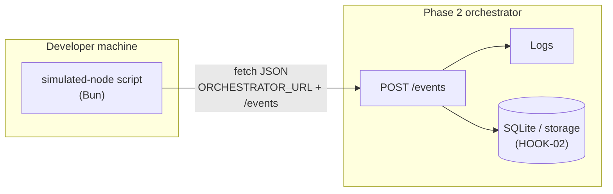

# Phase 3: Simulated node - Research

**Researched:** 2026-04-15  
**Domain:** Bun CLI script, HTTP client (`fetch`), environment configuration, `bun:test` validation  
**Confidence:** MEDIUM (orchestrator request/response contract finalized in Phase 2; this research binds to REQUIREMENTS.md until implementation lands)

## Summary

Phase 3 adds a **simulated “node”**: a small Bun/TypeScript program that **POSTs realistic JSON event payloads** to the Phase 2 webhook orchestrator—**no sensors or hardware**. The lab stack already standardizes on **Bun** (not Node for app scripts), **TypeScript**, and **`bun:test`** for tests [VERIFIED: `.planning/codebase/STACK.md`, `.planning/codebase/TESTING.md`]. The orchestrator is expected to expose **POST `/events`** per roadmap success criteria [VERIFIED: `.planning/ROADMAP.md`]; **HOOK-01** requires a payload with **home id**, **event type**, and optional JSON body [VERIFIED: `.planning/REQUIREMENTS.md`].

Use the **Web `fetch` API** built into Bun for outbound HTTP—no extra HTTP client dependency. Parse CLI flags with Node’s **`util.parseArgs`** and **`Bun.argv`** as documented for Bun [CITED: https://github.com/oven-sh/bun/blob/main/docs/guides/process/argv.mdx]. Read **`ORCHESTRATOR_URL`** from the environment (Bun loads `.env` automatically per project docs [VERIFIED: `.planning/codebase/STACK.md`]); support **at least two distinct `eventType` values** (e.g. motion, door; include a **camera stub** payload as a third sample or as one of the two types per product wording). Success for the phase is **observable**: events appear in **Phase 2 storage or logs** after `bun run` of a documented script.

**Primary recommendation:** Implement `scripts/simulated-node.ts` (or equivalent) that builds canonical payloads matching Phase 2’s accepted shape, **`fetch(`${base}/events`, { method: "POST", ... })`**, exits non-zero on HTTP errors, and document **`bun run …`** plus **`ORCHESTRATOR_URL`**; add **`bun:test`** for URL normalization and payload shape, and a **documented manual smoke** step against a running orchestrator.

<phase_requirements>
## Phase Requirements

| ID | Description | Research Support |
|----|-------------|-------------------|
| NODE-01 | A small script or CLI can emit sample events to the orchestrator (motion, door, camera stub) without real hardware. | Bun `fetch` POST JSON [CITED: Bun fetch guide]; `ORCHESTRATOR_URL` + `/events`; ≥2 event types; optional `util.parseArgs` for `--home`, `--type`, `--count`; tests for helpers + smoke instructions. |
</phase_requirements>

## Project Constraints (from `.cursor/rules/`)

Actionable directives embedded in `.cursor/rules/gsd-project.md` (sourced from `PROJECT.md` / codebase maps):

- **Runtime/scripts:** Use **Bun** — `bun install`, `bun run`, `bun test`; not Node/npm for project scripts [VERIFIED: `.cursor/rules/gsd-project.md`].
- **Languages:** **TypeScript** application code; **React** reserved for UI phases [VERIFIED: same].
- **Storage (lab):** **Bun SQLite** (`bun:sqlite`) for persistence where applicable; Phase 3 script does not own DB writes [VERIFIED: same].
- **Server pattern (orchestrator, not this phase):** Prefer **`Bun.serve()`** when adding HTTP servers; no Vite/Express for server per project docs [VERIFIED: same — relevant as consumer of orchestrator URL].
- **Workflow:** Prefer starting work through GSD commands so `.planning/` stays consistent [VERIFIED: `.cursor/rules/gsd-project.md` GSD section].

Research does **not** recommend adding Axios, node-fetch, or Undici for this phase: **native `fetch`** matches stack and avoids new dependencies.

## Architectural Responsibility Map

| Capability | Primary Tier | Secondary Tier | Rationale |
|------------|----------------|----------------|-----------|
| Emit sample events (HTTP client) | **CLI / script (dev machine)** | — | Simulated node runs locally; no browser. |
| Serialize JSON payloads | **CLI / script** | — | Pure data shaping before POST. |
| Accept & persist events | **API / Backend (Phase 2 orchestrator)** | Database / Storage | Ingestion and durability are orchestrator concerns. |
| Visible in logs/storage | **API / Backend + Storage** | — | Phase 3 only *sends*; verification reads orchestrator behavior. |

## Standard Stack

### Core

| Library / API | Version | Purpose | Why Standard |
|---------------|---------|---------|--------------|
| **Bun runtime** | 1.3.8 local [VERIFIED: `bun --version`]; lockfile references `bun-types` via `@types/bun` [VERIFIED: `.planning/codebase/STACK.md`] | Execute script and tests | Project mandate |
| **Web `fetch`** | Built into Bun | POST JSON to orchestrator | Same API as browsers; documented in Bun guides [CITED: https://github.com/oven-sh/bun/blob/main/docs/guides/http/fetch.mdx] |
| **`util.parseArgs`** (Node compat) | Built into Bun | CLI flags (`--url`, `--home`, etc.) | Official Bun argv guide [CITED: https://github.com/oven-sh/bun/blob/main/docs/guides/process/argv.mdx] |
| **TypeScript** | ^5 peer; lockfile `5.9.3` [VERIFIED: `STACK.md`] | Types for payloads and CLI | Existing project setup |

### Supporting

| Library | Version | Purpose | When to Use |
|---------|---------|---------|-------------|
| `@types/bun` | **1.3.12** [VERIFIED: npm registry `npm view @types/bun version`] | Editor/types for `Bun` globals | Already in `package.json` (`latest` → align lockfile on next install) |

### Alternatives Considered

| Instead of | Could Use | Tradeoff |
|------------|-----------|----------|
| `fetch` | `axios` | Extra dependency; no benefit for simple POST [ASSUMED] |
| `util.parseArgs` | `commander`, `yargs` | Heavier; only needed if CLI grows large [ASSUMED] |

**Installation:** No new runtime packages required for HTTP/argv beyond existing dev types.

**Version verification:**

```bash
bun --version
npm view @types/bun version
```

## Architecture Patterns

### System Architecture Diagram



### Recommended Project Structure

```
/
├── scripts/
│   └── simulated-node.ts    # CLI: send sample events
├── scripts/
│   └── simulated-node.test.ts   # or co-located *.test.ts — payload/url helpers
├── package.json             # "simulate" or "node:simulate" script
└── README.md                # document ORCHESTRATOR_URL + bun run command
```

### Pattern 1: POST JSON with `fetch`

**What:** Single POST with `Content-Type: application/json` and `JSON.stringify` body.  
**When to use:** All orchestrator event submissions.  
**Example:**

```typescript
// Source: https://github.com/oven-sh/bun/blob/main/docs/guides/http/fetch.mdx
const response = await fetch(`${baseUrl.replace(/\/$/, "")}/events`, {
  method: "POST",
  headers: { "Content-Type": "application/json" },
  body: JSON.stringify(payload),
});
if (!response.ok) {
  throw new Error(`POST /events failed: ${response.status} ${await response.text()}`);
}
```

### Pattern 2: CLI options with `util.parseArgs` + `Bun.argv`

**What:** Structured flags for orchestrator URL override, home id, which event types to send.  
**When to use:** Replace or supplement env-only configuration for local testing.  
**Example:**

```typescript
// Source: https://github.com/oven-sh/bun/blob/main/docs/guides/process/argv.mdx
import { parseArgs } from "node:util";

const { values } = parseArgs({
  args: Bun.argv,
  options: {
    url: { type: "string" },
    home: { type: "string" },
  },
  strict: true,
  allowPositionals: true,
});
```

### Anti-Patterns to Avoid

- **Hardcoding localhost without env:** Prefer `ORCHESTRATOR_URL` so CI or another machine can target a real orchestrator base URL.
- **Silent failure on non-2xx:** Exit with non-zero status and print response body for debugging (matches “visible in logs” success criteria).
- **Duplicating Phase 2 schema by guess:** Import a shared type module from the orchestrator package once Phase 2 exports it; until then, centralize payload types in one file and sync when HOOK-01 stabilizes.

## Don't Hand-Roll

| Problem | Don't Build | Use Instead | Why |
|---------|-------------|-------------|-----|
| HTTP POST with JSON | Raw `Bun.connect` / sockets | `fetch` | Standard, testable, documented [CITED: Bun fetch guide] |
| Env loading | Custom `.env` parser | Bun built-in `.env` loading [VERIFIED: STACK.md] + `process.env` | Less code, project convention |
| Arg parsing | Manual `process.argv` slicing | `util.parseArgs` | Fewer edge-case bugs [CITED: Bun argv guide] |

**Key insight:** The only “interesting” code should be **realistic fake payloads** and **CLI ergonomics**—not HTTP or env plumbing.

## Common Pitfalls

### Pitfall 1: Wrong URL joining

**What goes wrong:** Double slashes or missing path so requests hit the wrong route.  
**Why it happens:** `ORCHESTRATOR_URL` sometimes includes trailing `/`.  
**How to avoid:** Normalize base URL (strip trailing slash) before appending `/events`.  
**Warning signs:** 404 or HTML error body from wrong server.

### Pitfall 2: Schema drift from Phase 2

**What goes wrong:** Orchestrator rejects payloads (`400`) after Phase 2 chooses `home_id` vs `homeId`.  
**Why it happens:** NODE-01 examples in REQUIREMENTS are semantic, not a frozen JSON schema.  
**How to avoid:** Single module for event payload types; update once when Phase 2 handler is implemented; add a smoke test checklist in README.  
**Warning signs:** Consistent 400 responses with validation errors.

### Pitfall 3: “Tests pass” but no real traffic

**What goes wrong:** Unit tests mock `fetch` and never verify orchestrator integration.  
**Why it happens:** Nyquist/unit bias without manual smoke.  
**How to avoid:** Document **`bun run …`** against a **running** Phase 2 server; optionally `test.skip` integration unless `ORCHESTRATOR_URL` is set.  
**Warning signs:** Phase gate passes locally with orchestrator off.

## Code Examples

### Canonical payload shape (align to HOOK-01)

```typescript
// Field names MUST match Phase 2 handler — confirm when Phase 2 ships [ASSUMED: naming]
interface NodeEventPayload {
  homeId: string;
  eventType: "motion" | "door" | "camera.stub" | string;
  body?: Record<string, unknown>;
}
```

### Two event types minimum (motion + door); camera as stub

```typescript
// Illustrative only — tune keys to match orchestrator validation
const samples: NodeEventPayload[] = [
  { homeId, eventType: "motion", body: { zone: "driveway", confidence: 0.92 } },
  { homeId, eventType: "door", body: { doorId: "front", state: "closed" } },
  { homeId, eventType: "camera.stub", body: { clipId: "demo-001", reason: "motion" } },
];
```

## State of the Art

| Old Approach | Current Approach | When Changed | Impact |
|--------------|------------------|--------------|--------|
| `node-fetch` on Node | Bun built-in `fetch` | Bun 1.x | No extra package |
| Custom argv parsing | `util.parseArgs` | Node 18+ / Bun | Structured flags |

**Deprecated/outdated:**

- None specific to this thin client; avoid adding deprecated polyfills for `fetch`.

## Assumptions Log

| # | Claim | Section | Risk if Wrong |
|---|-------|---------|----------------|
| A1 | Phase 2 exposes **POST `/events`** at `{ORCHESTRATOR_URL}/events` | Summary, patterns | Script targets wrong path; needs one-line config change |
| A2 | JSON fields **`homeId`**, **`eventType`**, optional **`body`** match validation | Payload examples | 400 errors until names aligned with Phase 2 |
| A3 | “Camera stub” can be a distinct **`eventType`** or a sample object under motion | NODE-01 | Requirement still met if two types are motion + door and camera is extra demo payload |

**If Phase 2 uses different paths or fields:** update `scripts/simulated-node.ts` and shared types only—no architectural change.

## Open Questions

1. **Exact JSON schema for POST `/events`**
   - What we know: HOOK-01 requires home id, event type, optional JSON body [VERIFIED: REQUIREMENTS.md].
   - What's unclear: Property names and required vs optional fields.
   - Recommendation: Block implementation on Phase 2 handler or add a tiny shared `packages/types` / `src/types/events.ts` once orchestrator exists.

2. **Authentication headers (API key / Bearer)?**
   - What we know: v1 is local lab; REQUIREMENTS “Out of Scope” includes production security [VERIFIED: REQUIREMENTS.md].
   - What's unclear: Whether Phase 2 adds a dev token header.
   - Recommendation: If HOOK implementation adds `Authorization`, extend script to read `ORCHESTRATOR_TOKEN` from env.

## Environment Availability

| Dependency | Required By | Available | Version | Fallback |
|------------|-------------|-----------|---------|----------|
| Bun | Script + tests | ✓ | 1.3.8 [VERIFIED: local `bun --version`] | Install from https://bun.sh |
| Phase 2 orchestrator (running process) | End-to-end success criteria | ✗/✓ (dev-dependent) | — | Manual: start orchestrator before smoke run; document in README |
| `ORCHESTRATOR_URL` | Target base URL | ✗ until set | — | Default `http://127.0.0.1:<port>` in docs only if Phase 2 fixes port |

**Missing dependencies with no fallback:**

- Running orchestrator — **blocks** “events visible in Phase 2 storage/logs” verification.

**Missing dependencies with fallback:**

- None for the script itself; integration testing can be **skipped in CI** with `test.skip` when URL unset.

## Validation Architecture

> `workflow.nyquist_validation` is **enabled** in `.planning/config.json` [VERIFIED].

### Test Framework

| Property | Value |
|----------|-------|
| Framework | **bun:test** (built-in) [VERIFIED: `.planning/codebase/TESTING.md`] |
| Config file | None required — no `bunfig.toml` detected [VERIFIED: TESTING.md] |
| Quick run command | `bun test scripts/simulated-node.test.ts` (path TBD when added) |
| Full suite command | `bun test` |

### Phase Requirements → Test Map

| Req ID | Behavior | Test Type | Automated Command | File Exists? |
|--------|----------|-----------|-------------------|---------------|
| NODE-01 | Payload includes ≥2 distinct `eventType` values for a run | unit | `bun test scripts/simulated-node.test.ts -x` | ❌ Wave 0 |
| NODE-01 | URL builder appends `/events` without double slashes | unit | same | ❌ Wave 0 |
| NODE-01 | Successful POST results in orchestrator persistence / logs | integration / manual | `ORCHESTRATOR_URL=http://127.0.0.1:PORT bun run simulate` then check DB/logs | Manual until orchestrator test harness exists |

### Sampling Rate

- **Per task commit:** `bun test` scoped to new `*.test.ts` files.
- **Per wave merge:** `bun test` full repo.
- **Phase gate:** `bun test` green + documented **`bun run`** smoke with running Phase 2 (per roadmap success criteria).

### Wave 0 Gaps

- [ ] `scripts/simulated-node.test.ts` (or co-located) — covers URL normalization + payload factory emitting ≥2 types.
- [ ] `package.json` script entry — e.g. `"simulate": "bun run scripts/simulated-node.ts"` — referenced in README.
- [ ] Document manual verification: orchestrator up → run script → query GET/list or tail logs (exact steps depend on Phase 2).

## Security Domain

Prototype scope: **no production hardening** per REQUIREMENTS “Out of Scope” [VERIFIED]. Still apply basic hygiene:

### Applicable ASVS Categories

| ASVS Category | Applies | Standard Control |
|---------------|---------|------------------|
| V2 Authentication | Optional | If Phase 2 adds dev token, pass via env—not CLI flags in shell history when avoidable [ASSUMED] |
| V3 Session Management | no | — |
| V4 Access Control | no | Script runs as dev user |
| V5 Input Validation | yes | Validate `ORCHESTRATOR_URL` is http(s) before fetch; reject odd schemes [ASSUMED] |
| V6 Cryptography | no | TLS depends on URL (local http OK for lab) |

### Known Threat Patterns for this stack

| Pattern | STRIDE | Standard Mitigation |
|---------|--------|---------------------|
| SSRF via crafted `ORCHESTRATOR_URL` | Spoofing | Restrict to `http:`/`https:`; optional allowlist for lab [ASSUMED] |
| Secrets in payload `body` | Information disclosure | Do not put real credentials in sample events |

## Sources

### Primary (HIGH confidence)

- [CITED: https://github.com/oven-sh/bun/blob/main/docs/guides/http/fetch.mdx] — POST JSON with `fetch`
- [CITED: https://github.com/oven-sh/bun/blob/main/docs/guides/process/argv.mdx] — `Bun.argv`, `util.parseArgs`
- `.planning/REQUIREMENTS.md` — NODE-01, HOOK-01 wording
- `.planning/ROADMAP.md` — Phase 3 success criteria, `/events`
- `.planning/codebase/STACK.md`, `TESTING.md` — Bun, `bun:test`
- `@types/bun` **1.3.12** — [VERIFIED: npm registry]

### Secondary (MEDIUM confidence)

- Local `bun --version` → **1.3.8** (runtime may differ from npm `bun` package version)

### Tertiary (LOW confidence)

- Field naming (`homeId` vs `home_id`) — **not** verified against Phase 2 code (not yet in repo); see Assumptions Log

## Metadata

**Confidence breakdown:**

- Standard stack: **HIGH** — Bun `fetch` + `util.parseArgs` documented and aligned with project rules.
- Architecture: **MEDIUM** — depends on Phase 2 URL/path/schema.
- Pitfalls: **HIGH** — URL joining and schema drift are common integration issues.

**Research date:** 2026-04-15  
**Valid until:** ~30 days (stable APIs); revisit immediately when Phase 2 PLAN/implementation merges.

---

## RESEARCH COMPLETE

**Phase:** 03 - Simulated node  
**Confidence:** MEDIUM

### Key Findings

- Use **Bun’s native `fetch`** to **POST JSON** to `{ORCHESTRATOR_URL}/events`; no extra HTTP library.
- Use **`util.parseArgs` + `Bun.argv`** for CLI flags; **`ORCHESTRATOR_URL`** from env (Bun loads `.env` per project docs).
- Emit **≥2 distinct `eventType` values** (motion, door) and include a **camera stub** sample per NODE-01; exact JSON keys must align with Phase 2 when built.
- **Validate** with **`bun:test`** for helpers + **documented smoke** against a running orchestrator for storage/log visibility.
- **Graphify:** disabled in this workspace — no graph cross-links [VERIFIED: `gsd-tools graphify status`].

### File Created

`.planning/phases/03-simulated-node/03-RESEARCH.md`

### Confidence Assessment

| Area | Level | Reason |
|------|-------|--------|
| Standard Stack | HIGH | Bun docs + npm + STACK |
| Architecture | MEDIUM | Orchestrator contract not yet in codebase |
| Pitfalls | HIGH | Common integration mistakes well documented |

### Open Questions

- Exact POST body schema and auth header for Phase 2 (see Open Questions).

### Ready for Planning

Research complete. Planner can now create PLAN.md files.
