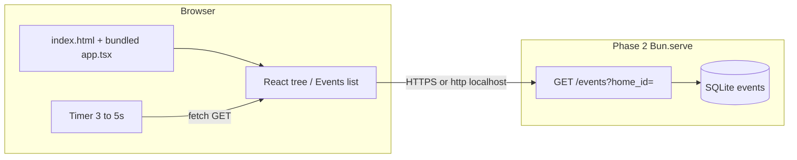

# Phase 4: React client - Research

**Researched:** 2026-04-15  
**Domain:** Bun-bundled React SPA, orchestrator HTTP read path, live updates (poll vs SSE)  
**Confidence:** HIGH (Bun/React patterns verified against official docs + npm registry); MEDIUM (exact repo layout left to planner)

<user_constraints>
## User Constraints (from CONTEXT.md)

No `04-*-CONTEXT.md` exists for this phase. **Binding inputs** are `PROJECT.md`, `.cursor/rules/gsd-project.md`, `04-UI-SPEC.md`, Phase 2 orchestrator behavior, and v1 requirements **UI-01** / **UI-02**.

### Locked Decisions

- **Stack:** Bun (not Node for app scripts), TypeScript, **React** for UI; prefer clarity over microservices. [`PROJECT.md` / `.cursor/rules/gsd-project.md`]
- **HTTP server / bundling:** Project conventions prescribe **`Bun.serve()`** and **HTML imports** (full-stack pattern) — **not Vite, not Express** when adding a server. [`.planning/codebase/STACK.md`, `.cursor/rules/gsd-project.md`]
- **Read API (Phase 2):** Events are listed via **`GET /events`** with query param **`home_id`** (required), returning JSON for that home (newest-first recommended). [`.planning/phases/02-webhook-orchestrator/02-02-PLAN.md` — aligns with `02-RESEARCH.md` HOOK-02]

### Claude's Discretion

- **Live updates (UI-02):** Roadmap allows **polling, SSE, or WebSocket**; `04-UI-SPEC.md` explicitly allows **polling every 3–5s** (configurable) with **no full page navigation** on new data.
- **Client packaging:** Either **`bun ./index.html`** dev server *or* **`import app from "./index.html"`** + `Bun.serve({ routes: { "/": app } })` — both are documented Bun patterns. [CITED: https://bun.sh/docs/runtime/http/server — HTML imports; https://bun.sh/docs/bundler/html — standalone HTML entry]

### Deferred Ideas (OUT OF SCOPE)

- Real OAuth/sessions (**AUTH-01**), production Postgres (**POSTGRES-01**), RPi/Buildroot, HomeKit/native mobile — per `REQUIREMENTS.md` v2 / out of scope. [`.planning/REQUIREMENTS.md`]
- **shadcn / component libraries** for v1 lab — `04-UI-SPEC.md` selects **none** (functional React + minimal CSS).
</user_constraints>

<phase_requirements>
## Phase Requirements

| ID | Description | Research Support |
|----|-------------|------------------|
| **UI-01** | User can view a list of recent events for a home | `fetch` (or `Bun.serve` test client) to **`GET /events?home_id=<n>`**; map JSON to list UI; empty/error copy from `04-UI-SPEC.md` |
| **UI-02** | User can see alerts when new events arrive (polling or SSE/WebSocket acceptable) | **Default recommendation:** **`setInterval` / `setTimeout` loop** polling `GET /events` at **3–5s** per UI-SPEC; compare to previous snapshot to highlight “new” rows. Optional: **SSE** only if orchestrator exposes `text/event-stream` (not locked in Phase 2 plan). |
</phase_requirements>

## Summary

Phase 4 delivers a **browser-visible** slice of the pipeline: a **React** UI that loads without requiring a manual full reload for updates, reads **recent events** for a configured **home** from the Phase 2 orchestrator, and surfaces **new arrivals** (accent highlight / “new” affordance per `04-UI-SPEC.md`). The project stack explicitly favors **Bun’s native bundler** — either **`bun ./index.html`** for a static/SPA dev flow or **`import index from "./index.html"`** wired into **`Bun.serve({ routes: { "/": index } })`** — which bundles TypeScript/JSX and avoids introducing **Vite** as a separate toolchain. [CITED: https://bun.sh/docs/runtime/http/server] [CITED: https://bun.sh/docs/bundler/html]

**Orchestrator base URL** for the browser should be injected via **Bun’s documented client env inlining** using a **`PUBLIC_*` prefix** and **literal `process.env.PUBLIC_…` references** in source (see Standard Stack). This replaces Vite’s `import.meta.env.VITE_*` pattern, which **does not apply** unless Vite is added — contrary to stack rules. [CITED: https://bun.sh/docs/bundler/html — Inline environment variables]

**Primary recommendation:** Implement the **Events** screen per `04-UI-SPEC.md` (dark theme, system font, minimal CSS), **`fetch(`${base}/events?home_id=${id}`)`** on load and on a **3–5s poll**, diff or max-id tracking for **“new”** highlighting, and **React’s default text escaping** for all API-driven strings (no `dangerouslySetInnerHTML` on untrusted fields). Add **`bun:test`** + **happy-dom** (or **@testing-library/react**) for hooks/components that build URLs and merge poll results.

## Architectural Responsibility Map

| Capability | Primary Tier | Secondary Tier | Rationale |
|------------|-------------|----------------|-----------|
| Event list rendering | Browser / Client | — | React components own DOM and local “new” state |
| Orchestrator HTTP API | API / Backend (Phase 2) | — | `GET /events?home_id=` is server-owned; client only consumes |
| Base URL + home id configuration | Browser / Client | Build / Bun serve | Env inlining or build-time `process.env.PUBLIC_*` [CITED: bundler html docs] |
| Live updates | Browser / Client | API (if SSE added later) | Poll loop is client-only; SSE would add server stream + `EventSource` |
| XSS-safe display of `event_type`, JSON body | Browser / Client | — | React text nodes + avoid raw HTML injection |

## Project Constraints (from `.cursor/rules/`)

- **Bun-first:** Use **`bun install`**, **`bun run`**, **`bun test`**; avoid prescribing Node/npm script stacks for the app. [embedded `gsd-project.md` / `STACK.md`]
- **No Vite/Express for the lab server:** Prefer **`Bun.serve()`** + **HTML import** pattern over a separate Vite dev server. [`.planning/codebase/STACK.md`]
- **Conventions:** Strict TS, **`verbatimModuleSyntax`**, kebab-case for non-React modules, PascalCase **`.tsx`** for components [`.planning/codebase/CONVENTIONS.md`]
- **GSD:** Substantive work should flow through GSD workflows when applicable [`.cursor/rules/gsd-project.md`]

## Standard Stack

### Core

| Library / module | Version | Purpose | Why Standard |
|------------------|---------|---------|----------------|
| **Bun** (runtime) | CLI **1.3.8** [VERIFIED: local `bun --version`]; npm meta **1.3.12** [VERIFIED: npm registry via `npm view bun version` in Phase 2 research] | Dev server, bundling, tests | Project mandate |
| **React** | **19.2.5** [VERIFIED: `npm view react version`] | UI components | `PROJECT.md` + `tsconfig` already has `jsx: react-jsx` |
| **react-dom** | **19.2.5** [VERIFIED: `npm view react-dom version`] | `createRoot`, browser rendering | Paired with React |
| **TypeScript** | ^5 peer (lockfile often ~5.9.x) | Types | Existing peer dependency |

### Supporting (testing)

| Library | Version | Purpose | When to Use |
|---------|---------|---------|-------------|
| **happy-dom** | **20.9.0** [VERIFIED: `npm view happy-dom version`] | DOM environment for `bun:test` | Required for testing hooks/components using `fetch`/`document` |
| **@testing-library/react** | **16.3.2** [VERIFIED: `npm view @testing-library/react version`] | Render utilities, async UI | Optional but matches `04-VALIDATION.md` direction |

### Alternatives Considered

| Instead of | Could Use | Tradeoff |
|------------|-----------|----------|
| Bun HTML entry + `Bun.serve` | Vite dev server | **Conflicts with project stack guidance**; extra toolchain |
| `fetch` polling | **SSE** (`EventSource`) | SSE needs **streaming `GET`** on orchestrator + CORS; Bun docs show SSE with `server.timeout(req, 0)` for long streams [CITED: https://bun.sh/docs/runtime/http/server — SSE example]. Phase 2 plan does **not** lock an SSE route — polling matches UI-SPEC default. |
| `process.env.PUBLIC_*` | `import.meta.env.VITE_*` | **Vite-specific**; not used if Bun bundles the client [CITED: https://bun.sh/docs/bundler/html — only literal `process.env` inlined, not `import.meta.env`] |

**Installation (illustrative — planner pins in `package.json`):**

```bash
bun add react react-dom
bun add -d @types/react @types/react-dom happy-dom @testing-library/react
```

**Version verification:** Registry versions above were checked with **`npm view <pkg> version`** on 2026-04-15.

## Architecture Patterns

### System Architecture Diagram



### Recommended project structure

```
src/
├── client/                 # or web/ — kebab-case dirs
│   ├── index.html          # <script src="./main.tsx" type="module">
│   ├── main.tsx            # createRoot, App
│   ├── app.tsx             # Events screen
│   ├── api/
│   │   └── events-client.ts # base URL + fetchEvents(homeId)
│   └── styles.css          # minimal panel/list styles
├── server.ts               # optional: Bun.serve imports HTML for "/"
```

(Exact paths are planner discretion.)

### Pattern 1: Bun full-stack — HTML import in `Bun.serve`

**What:** Import the SPA entry HTML and mount it on `/` so one process serves both API (if colocated) and UI assets.  
**When:** Single dev command, production build with `bun build --target=bun` per docs.  
**Example:**

```ts
// Source: https://bun.sh/docs/runtime/http/server (HTML imports)
import myReactSinglePageApp from "./index.html";

Bun.serve({
  routes: {
    "/": myReactSinglePageApp,
  },
});
```

### Pattern 2: Standalone frontend dev — `bun ./index.html`

**What:** Bun’s dev server bundles TS/JSX/CSS from an HTML entry with zero Vite.  
**When:** UI talks to orchestrator on another port (Phase 2 default **3000**).  
**Example:** `bun ./src/client/index.html` [CITED: https://bun.sh/docs/bundler/html — `bun ./index.html`]

### Pattern 3: Orchestrator URL + `GET /events`

**What:** Build `new URL("/events", base)` or string concat with normalized base (no double slash), append **`?home_id=${encodeURIComponent(String(id))}`**.  
**When:** Every load + each poll tick.  
**Contract:** Phase 2 **`GET /events?home_id=`** (required). [`.planning/phases/02-webhook-orchestrator/02-02-PLAN.md`]

### Pattern 4: Polling for UI-02

**What:** `useEffect` + `setInterval` calling the same fetch as initial load; store **last seen max event id** or hash list to mark rows as new.  
**When:** Default for v1; interval **3–5s** per `04-UI-SPEC.md`.

### Pattern 5: XSS-safe rendering

**What:** Put `event_type`, serialized `body`, and timestamps in **JSX text** or `{JSON.stringify(body, null, 2)}` inside a `<pre>` — React escapes strings.  
**When:** Always for API-sourced strings.  
**Avoid:** `dangerouslySetInnerHTML` unless HTML is trusted and sanitized. [CITED: React docs — escaping; general knowledge verified as standard React behavior — treat as **[CITED: https://react.dev/learn/javascript-in-jsx-with-curly-braces]** for JSX expression rules]

### Anti-Patterns to Avoid

- **Adding Vite** “because frontend” — duplicates Bun’s bundler and conflicts with project guidance.
- **Trusting `innerHTML` for event payloads** — malicious orchestrator data could XSS; keep string-only rendering for v1.
- **SSE without server route** — `EventSource` fails if orchestrator has no streaming endpoint; polling works with existing `GET`.

## Don't Hand-Roll

| Problem | Don't Build | Use Instead | Why |
|---------|-------------|-------------|-----|
| Dev bundler for TS/JSX | Custom webpack | **Bun** `index.html` or **HTML import** | Official path; HMR + TS/JSX [CITED: bundler html] |
| String escaping for API fields | Regex sanitizer in app | **React text nodes** + avoid `dangerouslySetInnerHTML` | Default escaping covers typical JSON/string fields |
| URL construction | Ad-hoc concat | **`URL` API** + `encodeURIComponent` for `home_id` | Correct query encoding, fewer slash bugs |

**Key insight:** The “hard” parts are **correct API URL wiring**, **poll/state diffing**, and **tests** — not a bespoke bundler.

## Common Pitfalls

### Pitfall 1: `process` undefined in browser

**What goes wrong:** Bundled code references `process.env.X` without inlining; browser throws **`ReferenceError: process is not defined`**.  
**Why it happens:** Bun only inlines **literal** `process.env.FOO` when `env` mode is enabled; indirect access is not rewritten. [CITED: https://bun.sh/docs/bundler/html]  
**How to avoid:** Use **`PUBLIC_ORCHESTRATOR_URL`** (or similar) with **`bunfig.toml`** `[serve.static] env = "PUBLIC_*"` and **`const base = process.env.PUBLIC_ORCHESTRATOR_URL`** as a direct read.  
**Warning signs:** Crash only in browser, not in SSR/tests.

### Pitfall 2: CORS when UI and API differ by origin

**What goes wrong:** Browser blocks `fetch` from `localhost:5173`-style origin to `localhost:3000` without CORS headers.  
**Why it happens:** Cross-origin XHR rules.  
**How to avoid:** Serve UI from **same origin** as API (single `Bun.serve`), **or** add **`Access-Control-Allow-Origin`** on Phase 2 for dev localhost — planner must pick one. [ASSUMED: Phase 2 may need CORS tweak if split origins — verify implementation]

### Pitfall 3: SSE connection drops (idle timeout)

**What goes wrong:** Long-lived SSE stream closes after **10s** idle per default `idleTimeout`.  
**Why it happens:** Bun server default documented in server docs. [CITED: https://bun.sh/docs/runtime/http/server — idleTimeout; `server.timeout(req, 0)` for streams]  
**How to avoid:** If SSE is added later, call **`server.timeout(req, 0)`** on the streaming request.

### Pitfall 4: Polling storms

**What goes wrong:** Overlapping async fetches if interval < latency.  
**Why it happens:** No await coordination.  
**How to avoid:** **In-flight guard** (skip tick if previous `fetch` pending) or `async` IIFE per tick.

## Code Examples

### Fetch events (client)

```typescript
// Contract: Phase 2 GET /events?home_id=
// Source: project plan 02-02-PLAN.md
export async function fetchEvents(baseUrl: string, homeId: number): Promise<unknown[]> {
  const u = new URL("/events", baseUrl.endsWith("/") ? baseUrl : `${baseUrl}/`);
  u.searchParams.set("home_id", String(homeId));
  const res = await fetch(u);
  if (!res.ok) throw new Error(`events ${res.status}`);
  return (await res.json()) as unknown[];
}
```

### Env read for Bun client bundle

```typescript
// Source: https://bun.sh/docs/bundler/html — literal process.env only
const base = process.env.PUBLIC_ORCHESTRATOR_URL ?? "http://127.0.0.1:3000";
```

Configure `bunfig.toml` for dev:

```toml
# Source: https://bun.sh/docs/bundler/html
[serve.static]
env = "PUBLIC_*"
```

## State of the Art

| Old Approach | Current Approach | When Changed | Impact |
|--------------|------------------|--------------|--------|
| Separate Vite + Node API | Bun **HTML import** + `Bun.serve` | Bun 1.2+ HTML import routes | Fewer tools for this lab |
| Manual polling only | Same + optional SSE/`EventSource` | When orchestrator exposes streams | Lower latency updates |

**Deprecated/outdated for this repo:**

- **Vite as required dev server** — contradicts `STACK.md` / rules; use Bun’s bundler.

## Assumptions Log

| # | Claim | Section | Risk if Wrong |
|---|-------|---------|---------------|
| A1 | Phase 2 serves `GET /events?home_id=` on the same base URL as `POST /events` (different path) | Pattern 3 | Client calls wrong path — verify against landed code |
| A2 | CORS may need enabling if UI origin ≠ API origin | Pitfall 2 | fetch fails until CORS fixed |
| A3 | Event JSON shape includes fields sufficient for list (e.g. `id`, `event_type`, `created_at`, `body`) | Summary | UI mapping adjusts when types land |

## Open Questions (RESOLVED)

1. **Single process vs two ports?** — **RESOLVED:** Phase 4 plans use **split client + API** with optional `src/server.ts` CORS for dev (`04-02-PLAN.md`); same-origin is preferred when serving UI from the orchestrator, otherwise enable CORS.

2. **Exact TypeScript types for event rows?** — **RESOLVED:** Mirror **`src/types/events-api.ts`** / Phase 2 response shape: at minimum `id`, `home_id`, `event_type`, `created_at`, optional `body` — align imports or duplicate with a `// mirror Phase 2` comment.

## Environment Availability

| Dependency | Required By | Available | Version | Fallback |
|------------|-------------|-----------|---------|----------|
| Bun | bundler, tests | ✓ | 1.3.8 | Install from bun.sh |
| Browser | manual UAT | ✓ user machine | — | — |
| Phase 2 orchestrator | `GET /events` | [ASSUMED: dev runs when testing] | — | Mock `fetch` in unit tests |
| happy-dom / testing-library | component tests | After `bun add` | see Standard Stack | Skip RTL until deps added |

**Missing dependencies with no fallback:** None for research — implementation adds npm deps.

## Validation Architecture

> `workflow.nyquist_validation` is **enabled** in `.planning/config.json`. This section aligns with `.planning/phases/04-react-client/04-VALIDATION.md` and `.planning/codebase/TESTING.md`.

### Test Framework

| Property | Value |
|----------|-------|
| Framework | **`bun:test`** + **happy-dom** (or jsdom) + optional **@testing-library/react** [VERIFIED: versions in Standard Stack] |
| Config file | Optional `bunfig.toml` for test preload (e.g. happy-dom) — confirm against Bun docs when added [ASSUMED: preload pattern] |
| Quick run command | `bun test` |
| Full suite command | `bun test` |

### Phase Requirements → Test Map

| Req ID | Behavior | Test Type | Automated Command | File Exists? |
|--------|----------|-----------|-------------------|--------------|
| UI-01 | List renders from **mocked** `GET /events?home_id=` JSON | Unit/component | `bun test` (mock `globalThis.fetch`) | ❌ Wave 0 |
| UI-02 | New event id triggers highlight state (pure reducer / hook test) | Unit | `bun test` | ❌ Wave 0 |
| — | URL builder: base + `/events` + `home_id` query | Unit | `bun test` | ❌ Wave 0 |

### Sampling Rate

- **Per task commit:** `bun test` (scoped file if large)
- **Per wave merge:** `bun test`
- **Phase gate:** Full `bun test` green before `/gsd-verify-work`
- **Manual:** Browser check for polling UX (`04-VALIDATION.md`)

### Wave 0 Gaps

- [ ] Add **react**, **react-dom**, test deps to **`package.json`** (currently only `@types/bun` + TS peer)
- [ ] **`bunfig.toml`** for **`PUBLIC_*`** inlining if using `bun ./index.html` [CITED: bundler html]
- [ ] **`events-client.test.ts`** (or similar) — URL formation + fetch error handling
- [ ] Optional: happy-dom **preload** for RTL — verify Bun test docs for DOM environment

## Security Domain

Lab / local prototype per `REQUIREMENTS.md`; still avoid obvious XSS footguns.

### Applicable ASVS Categories

| ASVS Category | Applies | Standard Control |
|---------------|---------|------------------|
| V2 Authentication | no (v1 lab) | — |
| V3 Session Management | no | — |
| V4 Access Control | partial | Anyone who can reach orchestrator can read events — acceptable for local dev; do not expose broadly without auth |
| V5 Input Validation | yes | Treat API JSON as untrusted for **rendering**; use React text escaping; validate numeric `home_id` before requests |
| V6 Cryptography | no | TLS optional for localhost HTTP |

### Known Threat Patterns for this stack

| Pattern | STRIDE | Standard Mitigation |
|---------|--------|---------------------|
| XSS via event fields | Tampering | React default escaping; no raw HTML from API |
| CSRF to orchestrator | Spoofing | Less relevant for read-only GET from static page; POST not in Phase 4 scope |

## Sources

### Primary (HIGH confidence)

- https://bun.sh/docs/runtime/http/server — HTML imports, SSE + `server.timeout`, `idleTimeout`
- https://bun.sh/docs/bundler/html — `bun ./index.html`, **`PUBLIC_*` env inlining**, `process.env` literal requirement
- `.planning/phases/02-webhook-orchestrator/02-RESEARCH.md` — orchestrator stack
- `.planning/phases/02-webhook-orchestrator/02-02-PLAN.md` — **`GET /events?home_id=`**
- `.planning/phases/04-react-client/04-UI-SPEC.md` — visual/copy/polling cadence
- `npm view` — React 19.2.5, react-dom 19.2.5, happy-dom 20.9.0, @testing-library/react 16.3.2 [VERIFIED: npm registry]

### Secondary (MEDIUM confidence)

- `.planning/codebase/STACK.md`, `TESTING.md`, `CONVENTIONS.md`
- `.planning/PROJECT.md` — React + Bun mandate

### Tertiary (LOW confidence)

- React escaping behavior — confirm in implementation review; default JSX behavior is widely documented on react.dev

## Metadata

**Confidence breakdown:**

- Standard stack: **HIGH** — Bun docs + npm versions verified
- Architecture: **HIGH** — matches Phase 2 GET contract + UI-SPEC
- Pitfalls: **MEDIUM-HIGH** — CORS/orchestrator layout may need spot-check during integration

**Research date:** 2026-04-15  
**Valid until:** ~30 days (recheck Bun minor notes if upgrading)

---

## RESEARCH COMPLETE

**Phase:** 04 — React client  
**Confidence:** HIGH

### Key Findings

1. **Use Bun’s HTML pipeline** (`import "./index.html"` + `Bun.serve` **or** `bun ./index.html`) — **not Vite** — per official docs and project stack. [CITED: server + bundler html]
2. **Orchestrator read path** is **`GET /events?home_id=`** (Phase 2 plan); client builds URL with **`URL` + `searchParams`**. [`.planning/phases/02-webhook-orchestrator/02-02-PLAN.md`]
3. **UI-02:** **Polling 3–5s** matches `04-UI-SPEC.md`; SSE is optional and needs server support + CORS/stream tuning. [CITED: server docs for SSE timeouts]
4. **Env:** Prefer **`PUBLIC_ORCHESTRATOR_URL`** (or `PUBLIC_API_URL`) with Bun **`process.env`** inlining — **not** `VITE_*` unless Vite is adopted. [CITED: bundler html]
5. **XSS:** Default React rendering for string/JSON fields; avoid **`dangerouslySetInnerHTML`** for API payloads.

### File Created

`.planning/phases/04-react-client/04-RESEARCH.md`

### Confidence Assessment

| Area | Level | Reason |
|------|-------|--------|
| Standard stack | HIGH | Bun docs + npm registry versions |
| Architecture | HIGH | Roadmap + Phase 2 GET + UI-SPEC |
| Pitfalls | MEDIUM-HIGH | CORS/split-process integration TBD |

### Open Questions (RESOLVED)

- See **## Open Questions (RESOLVED)** above — split vs merged process and event row types are decided for planning.

### Ready for Planning

Research complete. Planner can create `PLAN.md` files for Phase 4.
